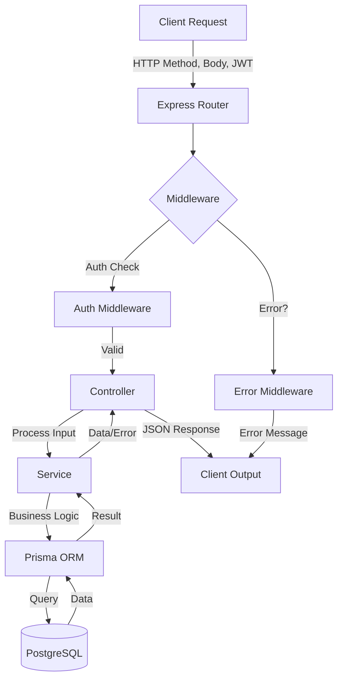

# Finance Backend

Backend REST API untuk aplikasi manajemen keuangan pribadi.

## 🛠️ Tech Stack & Arsitektur

Proyek ini menggunakan kombinasi teknologi modern untuk memastikan performa tinggi, skalabilitas, dan keamanan data:

| Komponen | Teknologi | Alasan & Fungsi |
| :--- | :--- | :--- |
| **Runtime** | **Node.js** | Lingkungan eksekusi JavaScript di sisi server yang asinkron dan efisien. |
| **Web Framework** | **Express 5** | Versi terbaru dari Express yang memberikan performa lebih baik dan penanganan *error* pada fungsi asinkron yang lebih stabil. |
| **Database ORM** | **Prisma** | *Object-Relational Mapper* (ORM) yang menjamin keamanan tipe (*type-safety*) dan memudahkan migrasi serta manipulasi database PostgreSQL. |
| **Database** | **PostgreSQL** | Sistem manajemen database relasional yang tangguh untuk menyimpan data transaksi dan user dengan integritas tinggi. |
| **Security** | **JWT & Bcrypt** | **JWT** digunakan untuk autentikasi stateless (aman tanpa session), sedangkan **Bcrypt** digunakan untuk *hashing* password user sebelum disimpan. |
| **Scheduling** | **Node-cron** | Library untuk menjalankan tugas otomatis (*cron jobs*), digunakan untuk fitur *auto-savings* harian. |
| **Testing** | **Jest** | Framework pengujian JavaScript untuk memastikan logika bisnis di level *service* berjalan dengan benar (Unit Testing). |
| **Analytics** | **Vercel Analytics** | Memberikan wawasan (*insight*) mengenai penggunaan halaman dokumentasi API (`/docs`). |

## Fitur
 **Autentikasi Aman:** Sistem registrasi dan login menggunakan JWT & bcrypt.
 **Manajemen Transaksi:** Pencatatan pemasukan/pengeluaran dengan dukungan kategori dinamis.
 **Kategori Kustom:** Kelola kategori transaksi (Gaji, Makanan, Transportasi, dll) per pengguna.
 **Target Tabungan (Savings Goals):** Pantau progres tabungan dengan fitur *Auto-Savings* bulanan.
 **Pengingat Tagihan (Reminders):** Sistem pengingat untuk tagihan jatuh tempo terdekat.
 **Otomatisasi Cron:** Pemrosesan otomatis tabungan bulanan (mendukung Vercel Cron & Local Cron).
 **Analitik Terintegrasi:** Dokumentasi interaktif dengan Vercel Web Analytics.
## 📂 Struktur Proyek
```text
finance-backend/
|-- lib/
|   `-- prisma.js
|-- api/
|   `-- index.js
|-- prisma/
|   |-- schema.prisma
|   `-- migrations/
|-- public/
|   `-- index.html
|-- src/
|   |-- app.js
|   |-- controllers/
|   |-- jobs/
|   |   `-- autoSavings.job.js
|   |-- middlewares/
|   |-- routes/
|   |-- services/
|   `-- index.js
|-- .env
`-- package.json
```

## 🔄 Alur Jalannya API (Data Flow)

Proyek ini mengikuti arsitektur **Controller-Service-Repository (Prisma)**. Berikut adalah alur data dari saat Client mengirimkan request hingga menerima response:



### Penjelasan Langkah:
1.  **Input (Client Request):** Client mengirimkan permintaan (misal: `POST /transactions`) dengan membawa data di `body` dan token akses di `header`.
2.  **Routing & Middleware:** 
    *   `src/routes` mencocokkan URL.
    *   `authMiddleware` memvalidasi JWT. Jika tidak valid, langsung dikembalikan sebagai error 401.
3.  **Controller (Entry Point):** `src/controllers` menerima data dari request, melakukan validasi dasar, lalu memanggil fungsi di Service yang sesuai.
4.  **Service (Business Logic):** `src/services` berisi logika bisnis utama (misal: menghitung sisa saldo sebelum mengizinkan pengeluaran). Service adalah satu-satunya bagian yang berkomunikasi dengan Prisma.
5.  **Prisma & Database:** `lib/prisma.js` melakukan operasi baca/tulis ke PostgreSQL.
6.  **Output (Response):** 
    *   Jika berhasil: Controller mengirimkan data dengan status 200/201.
    *   Jika gagal: `asyncHandler` menangkap error dan mengirimkannya ke `errorMiddleware` untuk menghasilkan format error JSON yang seragam (misal: `{ "error": "message" }`).


## 🛠️ Langkah Pengembangan (Development Steps)

Berikut adalah urutan langkah yang dilakukan dalam membangun proyek ini:

1.  **Inisialisasi Proyek:**
    *   Setup folder proyek dan inisialisasi `npm`.
    *   Instalasi dependency utama: `express`, `prisma`, `jsonwebtoken`, `bcrypt`, dan `dotenv`.

2.  **Konfigurasi Database & ORM:**
    *   Inisialisasi Prisma dengan `npx prisma init`.
    *   Mendefinisikan skema data (`User`, `Transaction`, `SavingsGoal`, `Reminder`, `TransactionCategory`) di `prisma/schema.prisma`.
    *   Melakukan migrasi awal ke PostgreSQL: `npx prisma migrate dev --name init`.

3.  **Pembangunan Infrastruktur Dasar:**
    *   Membuat *error handling* global menggunakan `error.middleware.js` dan `asyncHandler.js`.
    *   Setup koneksi database tunggal di `lib/prisma.js`.
    *   Membuat middleware autentikasi JWT (`auth.middleware.js`).

4.  **Pengembangan Modul (Auth, Transaction, Savings, Reminder):**
    *   **Service Layer:** Menulis logika bisnis di `src/services/` (misal: validasi saldo, perhitungan tabungan).
    *   **Controller Layer:** Menangani request/response di `src/controllers/`.
    *   **Routing:** Menghubungkan endpoint dengan controller di `src/routes/`.

5.  **Implementasi Fitur Otomatisasi:**
    *   Membuat *background job* di `src/jobs/autoSavings.job.js` menggunakan `node-cron`.
    *   Setup endpoint internal untuk pemicu cron manual/Vercel Cron.

6.  **Pengujian (Testing):**
    *   Menulis unit test menggunakan **Jest** di folder `__tests__/` untuk memastikan logika transaksi dan kategori berjalan sesuai ekspektasi.
    *   Menjalankan test dengan `npm test`.

7.  **Deployment Persiapan:**
    *   Konfigurasi `vercel.json` untuk deployment serverless.
    *   Setup script `postinstall` untuk memastikan Prisma Client digenerate otomatis di lingkungan production.

## 🎯 Hasil Akhir Proyek (Final Results)

Setelah melewati tahap pengembangan dan pengujian, proyek ini menghasilkan sistem backend yang:

1.  **API Berstandar Industri:** Menyediakan REST API dengan respon JSON yang konsisten, penanganan *error* yang informatif, dan keamanan berbasis token (JWT).
2.  **Dokumentasi Interaktif (`/docs`):** Halaman dokumentasi yang memudahkan pengembang frontend untuk mencoba setiap endpoint secara langsung tanpa alat tambahan (seperti Postman).
3.  **Automasi Tabungan Berjalan Sempurna:** Fitur *Auto-Savings* berhasil memproses penambahan saldo tabungan secara otomatis setiap hari sesuai pengaturan user, baik di server tradisional maupun *serverless* (Vercel Cron).
4.  **Integritas Data Terjamin:** Database PostgreSQL yang dikelola Prisma memastikan relasi antara User, Transaksi, dan Tabungan tetap konsisten dan aman.
5.  **Siap Produksi (Production Ready):** Teroptimasi untuk dideploy ke platform modern seperti Vercel atau Railway dengan konfigurasi variabel lingkungan yang fleksibel.

**Contoh Output Transaksi Sukses:**
```json
{
  "id": "uuid-123",
  "title": "Gaji Bulanan",
  "amount": "5000000.00",
  "type": "income",
  "category": "Salary",
  "date": "2026-03-06T00:00:00.000Z",
  "note": "Pemasukan rutin",
  "createdAt": "2026-03-06T10:00:00.000Z"
}
```

## Environment Variables
Buat file `.env`:

```env
DATABASE_URL="postgresql://<user>:<password>@<host>/<db>?sslmode=require"
JWT_SECRET="your_jwt_secret"
CRON_SECRET="your_random_secret_for_scheduled_jobs"
```

## Instalasi dan Menjalankan Project
1. Install dependency:
```bash
npm install
```
2. Jalankan migrasi database (pilih salah satu sesuai kebutuhan):
```bash
npx prisma migrate deploy
```
atau saat development:
```bash
npx prisma migrate dev
```
3. Jalankan server:
```bash
npm run dev
```

Server berjalan di `http://localhost:3000`.

## Authentication
Gunakan header berikut untuk endpoint protected:

```http
Authorization: Bearer <token>
```

## API Endpoints

### Documentation
- `GET /docs` - Interactive API documentation page with Vercel Web Analytics

### Auth
- `POST /auth/register`
- `POST /auth/login`
- `GET /auth/me` (protected)

Contoh request register/login:
```json
{
  "email": "user@mail.com",
  "password": "123456"
}
```

### Transactions (protected)
- `POST /transactions`
- `GET /transactions`
- `PUT /transactions/:id`
- `DELETE /transactions/:id`
- `GET /transactions/summary?month=2026-02`

Contoh body create transaction:
```json
{
  "title": "Gaji",
  "amount": 5000000,
  "type": "income",
  "category": "Salary",
  "date": "2026-02-23",
  "note": "Gaji Februari"
}
```

### Savings Goals (protected)
- `POST /savings`
- `GET /savings`
- `PUT /savings/:id/progress`
- `DELETE /savings/:id`

Contoh body create goal:
```json
{
  "title": "Dana Darurat",
  "targetAmount": 10000000,
  "deadline": "2026-12-31",
  "autoSaveDay": 25,
  "monthlyAmount": 500000
}
```

Contoh body update progress:
```json
{
  "amount": 250000
}
```

### Reminders (protected)
- `POST /reminders`
- `GET /reminders`
- `GET /reminders/upcoming`
- `PUT /reminders/:id/paid`
- `DELETE /reminders/:id`

Contoh body create reminder:
```json
{
  "title": "Bayar listrik",
  "amount": 350000,
  "type": "tagihan",
  "dueDate": "2026-03-01",
  "repeatInterval": "monthly"
}
```

## Auto Savings Job
File: `src/jobs/autoSavings.job.js`

Cron berjalan setiap hari pukul 00:00 server time (`0 0 * * *`):
- mencari `savingsGoal` dengan `autoSaveDay` sesuai tanggal hari ini
- menambahkan `monthlyAmount` ke `currentAmount`
- tidak melebihi `targetAmount`

## Deploy ke Railway
1. Push project ke GitHub.
2. Login ke Railway, lalu klik **New Project** -> **Deploy from GitHub repo**.
3. Pilih repository `finance-backend`.
4. Di service Railway, set environment variables:
```env
DATABASE_URL=postgresql://...
JWT_SECRET=your_secret
```
5. Set **Start Command** ke:
```bash
npm start
```
6. Jalankan migrasi database di Railway shell atau job sekali jalan:
```bash
npm run prisma:migrate:deploy
```
7. Redeploy service, lalu cek endpoint health sederhana (mis. `GET /auth/me` dengan token valid).

Catatan Railway:
- Railway otomatis inject `PORT`, dan app ini sudah membaca `process.env.PORT`.
- `node-cron` akan berjalan selama service backend aktif.
- Prisma Client digenerate saat install dependency melalui script `postinstall`.
- Setelah deploy pertama, rotate semua secret jika sebelumnya pernah tersimpan di `.env` lokal yang terpublikasi.

Troubleshooting Prisma (`Cannot find module '.prisma/client/default'`):
1. Pastikan deploy memakai commit terbaru (yang sudah punya `postinstall`).
2. Trigger redeploy dengan **Clear build cache**.
3. Jika perlu, jalankan manual di Railway shell:
```bash
npm run prisma:generate
```

## Deploy ke Vercel
1. Push project ke GitHub.
2. Di Vercel, klik **Add New -> Project**, lalu import repo ini.
3. Set environment variables di Vercel:
```env
DATABASE_URL=postgresql://...
JWT_SECRET=your_secret
CRON_SECRET=your_random_secret_for_scheduled_jobs
```
4. Deploy, lalu test endpoint:
```text
GET /health
POST /auth/login
```

Catatan Vercel:
- Semua route diarahkan ke `api/index.js` (lihat `vercel.json`).
- Auto-savings dijalankan melalui Vercel Cron harian (`0 0 * * *`) ke endpoint internal:
  `GET /internal/auto-savings/run`
- Endpoint internal diproteksi `CRON_SECRET` (middleware cek bearer token).
- Vercel Cron akan lolos autentikasi jika environment `CRON_SECRET` di-set.
- Vercel Web Analytics akan otomatis aktif pada halaman `/docs` setelah diaktifkan di dashboard Vercel.

## Vercel Web Analytics
Project ini sudah dilengkapi dengan Vercel Web Analytics pada halaman dokumentasi (`/docs`). 

Untuk mengaktifkan analytics:
1. Di Vercel dashboard, pilih project Anda
2. Klik tab **Analytics** 
3. Klik **Enable** untuk mengaktifkan Web Analytics
4. Setelah deployment berikutnya, analytics akan mulai merekam visitor data pada `/docs`

Analytics akan melacak:
- Page views dan visitor metrics
- Browser dan device information
- Geographic data
- Referral sources

Catatan: Analytics hanya aktif di production deployment Vercel, tidak di development lokal.

## Catatan
- Port server menggunakan `process.env.PORT` dengan fallback `3000`.
- Error response menggunakan format:
```json
{ "error": "message" }
```
